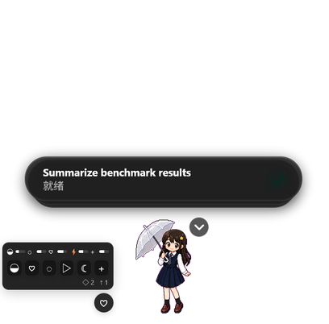

# Copet

Copet 为 Codex 桌面宠物加入可交互的养成玩法，同时保留原生 `/pet` 唤醒和收起方式。仓库既包含可直接体验的 Daisy，也包含从角色设定生成新宠物的完整技能。

当前运行时包含喂食、抚摸、洗澡、玩耍、睡觉和治疗，以及饱食、清洁、心情、体力、健康、成长、金币、库存、冷却、离线衰减和磁盘存档。所有结算均由数据清单确定，不使用隐藏随机数。



## 当前支持范围

- Windows 11
- Microsoft Store Codex `26.721.4979.0`
- Codex 应用版本 `26.721.41059`
- PowerShell 7、Node.js、npm
- Python 3 与 Pillow，用于素材流水线和校验

客户端补丁采用严格版本和哈希检查。版本不匹配时会直接停止，不会尝试套用不确定的修改。商店安装目录不会被修改，安装器只创建独立本地副本。

## 构建与安装

在仓库根目录打开 PowerShell 7：

```powershell
& '.\skill\assets\runtime\build-interactive-codex.ps1'
& '.\skill\assets\runtime\install-interactive-codex.ps1'
& '.\skill\assets\runtime\launch-interactive-codex.ps1' -IsolatedProfile
```

安装器会把 `pet.json`、官方图集、`interaction.json` 和互动图集作为一个完整宠物包安装。启动独立副本后，在 Codex 输入 `/pet`，选择宠物命令即可唤醒 Daisy。互动状态默认保存在 `%USERPROFILE%\.codex\pet-state\daisy.json`。

已有不同的互动素材时，普通安装会拒绝覆盖。明确升级整个互动包时使用：

```powershell
& '.\skill\assets\runtime\install-interactive-codex.ps1' -PetPackageOnly -UpgradePetPackage
```

`-PetPackageOnly` 会验证现有独立副本的安装标记和 `app.asar` 哈希，只更新完整宠物包。即使 Microsoft Store Codex 后续自动升级，也不会把旧客户端补丁套到新版本。

安装技能生成的其他宠物包时，指定它的 `package` 目录：

```powershell
& '.\skill\assets\runtime\install-interactive-codex.ps1' `
  -PetPackageOnly `
  -PetPackagePath 'C:\path\to\interaction-run\package'
```

目标目录已存在不同素材时，必须明确添加 `-UpgradePetPackage`，安装器不会静默覆盖。

## 生成自己的宠物

`skill` 是一个完整的 `hatch-interactive-pet` 技能。它先生成并校验 Codex 官方九行动画，再以同一个角色为基准生成十二组养成动画，最后输出可由 Copet 安装器直接使用的四文件包。

让 Codex 从 [`Shichien/Copet` 的 `skill` 子目录](https://github.com/Shichien/Copet/tree/main/skill)安装技能即可；该目录已经包含生成流水线、Daisy 示例包和当前版本的本地运行时，不依赖仓库外的 `hatch-pet` 文件。

在 Codex 中调用：

```text
Use $hatch-interactive-pet to create a feedable pet that wakes with /pet.
```

技能默认使用系统自带的 `imagegen`。用户明确选择兼容图像接口时，也可以只通过进程环境提供 `OPENAI_API_KEY`，再运行技能内的批量执行器；密钥不会写入任务清单、仓库或报告。

技能中的官方宠物流水线来自 OpenAI `hatch-pet`，固定在提交 [`49f948f`](https://github.com/openai/skills/tree/49f948faa9258a0c61caceaf225e179651397431/skills/.curated/hatch-pet)，并保留其 Apache 2.0 许可证。Copet 在此基础上增加互动图集、养成规则、完整包安装和本地运行时。

`skill/assets/runtime/app.asar` 由构建脚本从本机 Codex 生成，并被 `.gitignore` 排除，不属于仓库内容。

## 测试

```powershell
& '.\test.ps1'
```

该命令运行运行时单元测试、互动素材流水线测试和完整宠物包校验。

## 目录

- `skill/assets/runtime`：客户端加载、互动界面、磁盘存档、补丁、构建、安装和启动脚本
- `skill/assets/pet`：Daisy 官方宠物包、互动行为清单、十二组动画任务和参考素材
- `skill`：自包含的官方宠物生成、互动扩展、合图、预览、打包、校验和本地运行时
- `docs`：真实 Codex 独立副本的界面截图

## 素材状态

仓库已包含十二组 Daisy 正式互动动画。所有动画均由同一角色参考图生成，清除色键后合成为 `1536×2496` 图集，并通过 `skill/scripts/validate_interaction_pack.py` 严格校验。

`skill/assets/pet/interaction-jobs.json` 记录每组动画的提示词、参考图、帧数和完成状态。需要替换已安装独立副本中的旧测试素材时，使用 `-UpgradePetPackage` 完整升级互动包。
